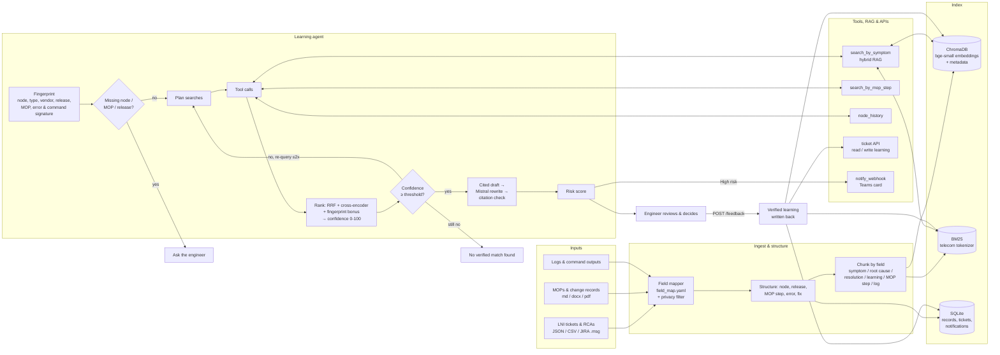

# Architecture

## At a glance

## The three moments

| Moment | Endpoint | What the agent does |
|---|---|---|
| **Before** a planned LNI | `POST /recommend` `mode=pre_change` | Fingerprints the plan, asks for a missing node / MOP / release, checks node history, checks every MOP step for past failures, searches similar LNIs, scores risk, sends a Teams card if risk is High |
| **During** an incident | `POST /match` (search only) or `POST /recommend` `mode=incident` | Fingerprints symptoms / logs / commands, searches by symptom and exact error signature, re-queries with synonyms if confidence is low, returns cited root cause, fix and validation steps |
| **After** resolution | `POST /feedback` | Engineer confirms the fix (and who verified it); stored as a verified record, indexed immediately, ticket updated |

## Retrieval pipeline (`backend/app/rag/search.py`)

1. **Dense**: `BAAI/bge-small-en-v1.5` (Hugging Face, ONNX via fastembed) in ChromaDB, with metadata `where` filters (node type, vendor, release, MOP, field).
2. **Keyword**: BM25 with a tokenizer that keeps `CMG-12`, `MOP-UPG-04`, `7.11.1`, `%BGP-5-ADJCHANGE` intact.
3. **Fusion**: Reciprocal Rank Fusion pools the top 30 candidates from both.
4. **Rerank**: cross-encoder `ms-marco-MiniLM-L-6-v2` (configurable to `bge-reranker-base`).
5. **Record aggregation**: chunk scores roll up to the LNI record; log snippets map to their related LNI.
6. **Fingerprint bonus**: same node / node type / vendor / release / MOP / error signature. Applied proportionally to the remaining headroom, so it cannot lift a weak match over the threshold.
7. **Duplicate grouping**: reworded duplicates of the same root cause are shown once, marked "seen N×", and all their IDs are cited.

## Guardrails (`backend/app/agent/guardrails.py`)

- **Clarifying questions**: a pre-change check without a node, MOP or target release is blocked until the engineer answers. For an incident, the question is offered while the search runs anyway.
- **Threshold**: below the confidence threshold the agent says **"No verified match found"** and suggests no fix.
- **Citation check**: every LLM bullet must cite a retrieved record. Bullets that are uncited, or that cite an unknown ID, are dropped and shown as removed. If nothing survives, the deterministic cited draft is used.
- **Read-only**: tools with side effects (`write_learning`, `notify_webhook`) are blocked in the agent loop. Write-back only happens through `POST /feedback`, with a named human verifier.
- **Privacy**: customer, case-ID and person columns are dropped at ingestion and e-mail addresses are redacted. The LLM runs locally, so no data leaves the machine.
